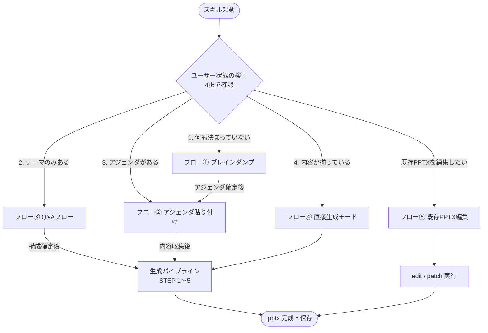
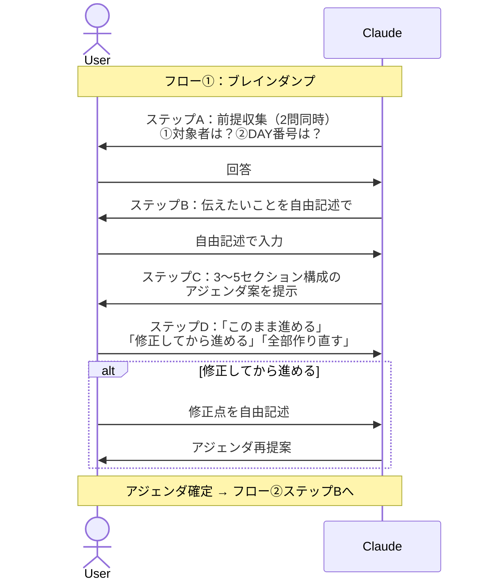
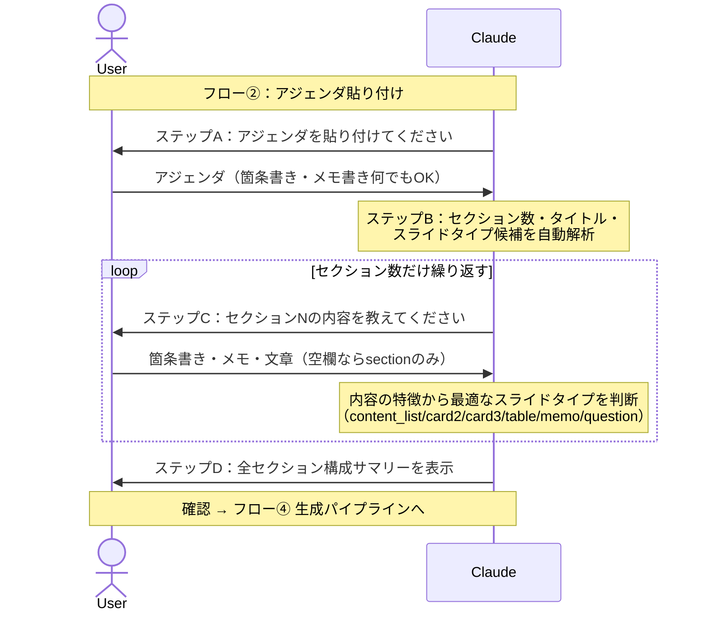
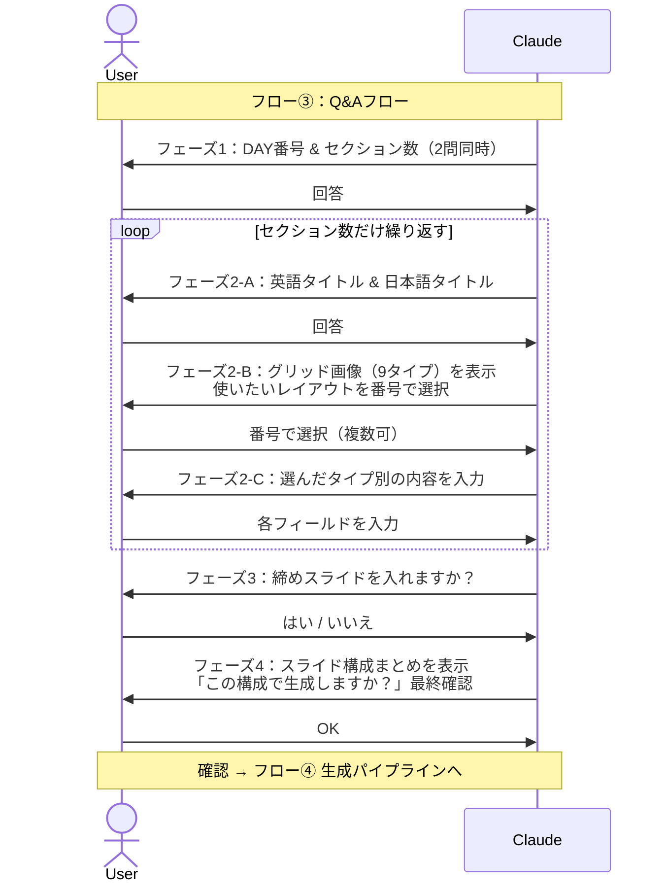
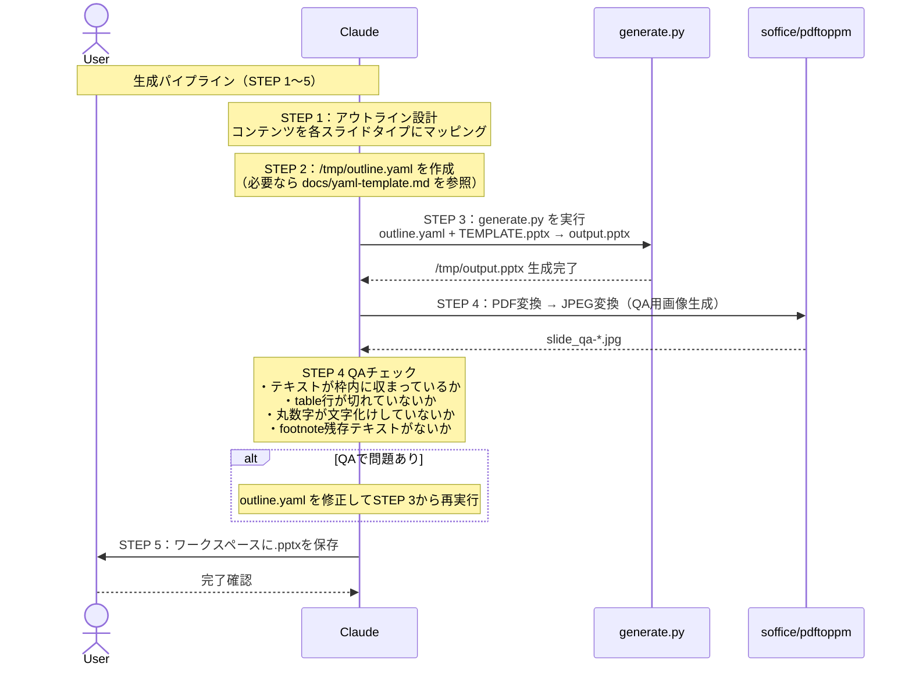
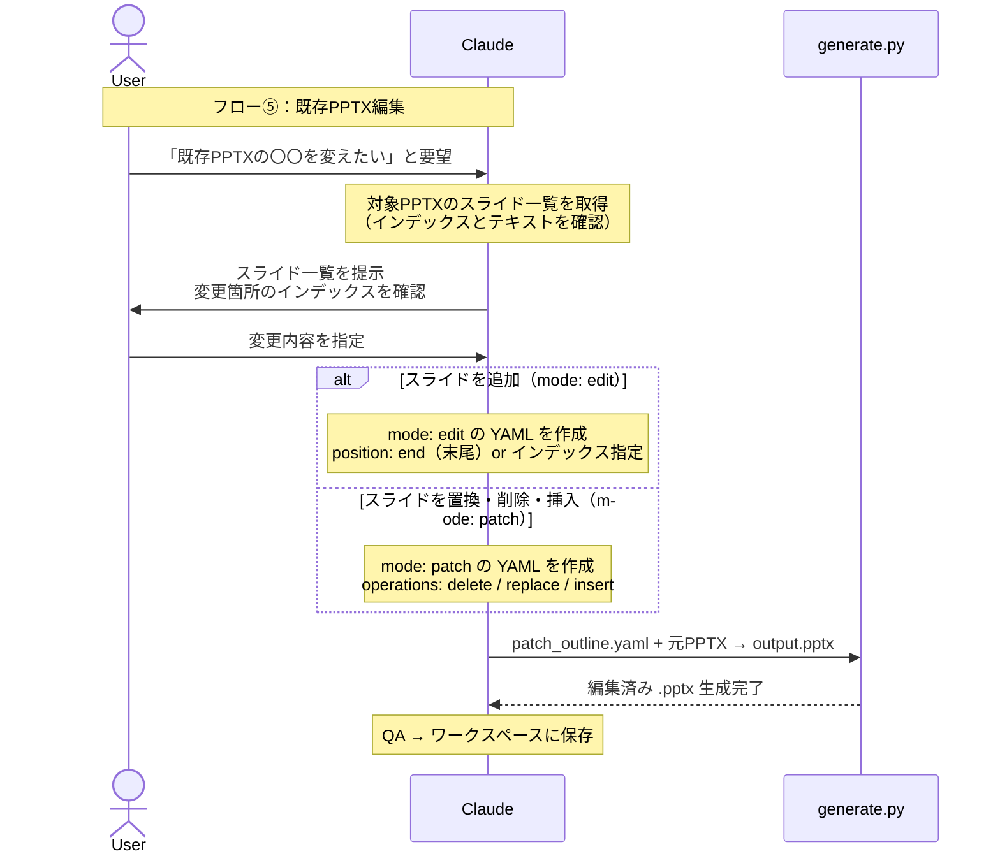
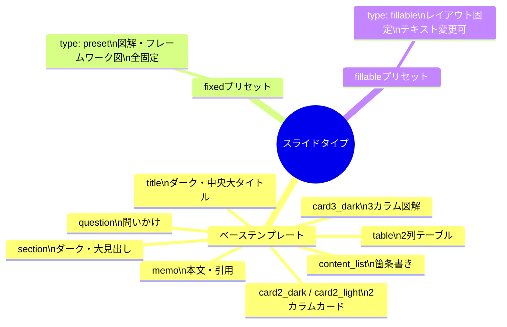
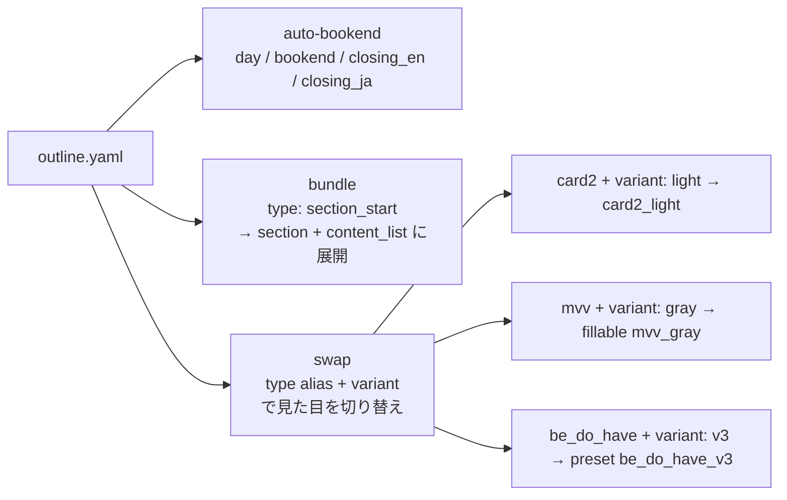

# jcc-slides スキル フロー解説

JCCブランドのPPTXスライドをテキスト入力から自動生成するスキルの処理フローを説明します。

---

## 全体フロー概要



---

## ユーザー状態の検出

スキル起動直後に1問のAsk（4択）でユーザーの準備状況を判定します。  
会話の文脈からすでに状態が明らかな場合（テキストが貼られている等）は質問をスキップします。

| 選択肢 | 状態名 | 進むフロー |
|--------|--------|-----------|
| 1. まだ何も決まっていない | braindump | フロー① |
| 2. テーマは決まっているが内容はこれから | theme-only | フロー③ |
| 3. アジェンダはあるが各スライドの内容がまだ | theme+agenda | フロー② |
| 4. 内容（テキスト・箇条書き）がほぼ揃っている | all-ready | フロー④ |

---

## フロー① ブレインダンプ（状態 1：何も決まっていない）

コンテンツがゼロの状態からClaudeが一緒にアジェンダを設計します。  
完了後はフロー②（アジェンダ貼り付け）へ引き継ぎます。



---

## フロー② アジェンダ貼り付け（状態 3：アジェンダがある）

章立てはあるがスライド内容がまだの状態。アジェンダを受け取り各セクションの内容を収集します。



---

## フロー③ Q&Aフロー（状態 2：テーマのみある）

テーマはあるが内容がゼロの状態。セクションごとに1つずつ質問して内容を収集します。



---

## フロー④ 直接生成モード（状態 4：内容が揃っている）＆ 生成パイプライン

すべてのフローの最終段階。YAMLを作成してスクリプトを実行し、QAを行って保存します。



---

## フロー⑤ 既存PPTXの編集（mode: edit / patch）

生成済みのPPTXへのスライド追加・置換・削除。



---

## スライドタイプ一覧

スキルが扱えるスライドの種類は大きく3カテゴリに分かれます。



---

## YAML オプション早見表



---

## ファイル構成

```
.claude/skills/jcc-slides/
├── SKILL.md                  # スキル本体（フロー分岐・STEP定義）
├── assets/
│   ├── TEMPLATE.pptx         # デザインテンプレート（34枚）
│   └── thumbnails/
│       ├── grid.jpg          # ベース9タイプのグリッド画像
│       ├── fixed_grid.jpg    # fixedプリセットのグリッド画像
│       └── fillable_grid.jpg # fillableプリセットのグリッド画像
├── scripts/
│   └── generate.py           # PPTX生成スクリプト（1,100行超）
├── flows/
│   ├── flow1_braindump.md    # フロー①の詳細手順
│   ├── flow2_agenda.md       # フロー②の詳細手順
│   ├── flow3_qa.md           # フロー③の詳細手順
│   └── flow5_edit.md         # フロー⑤の詳細手順
└── docs/
    ├── yaml-template.md      # 全タイプのYAMLフィールド一覧・サンプル
    ├── preset-fixed.md       # fixedプリセットのname一覧
    ├── preset-fillable.md    # fillableプリセットのname・スロット一覧
    └── slide-library.md      # スライドライブラリ
```
