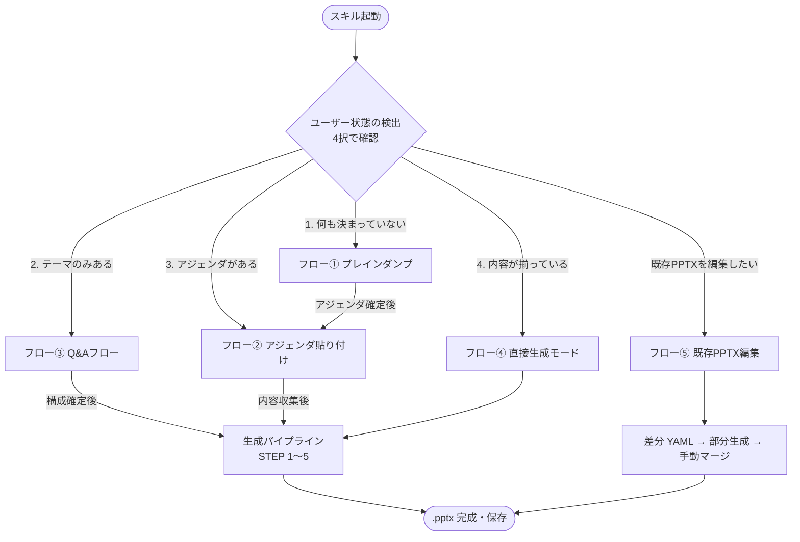
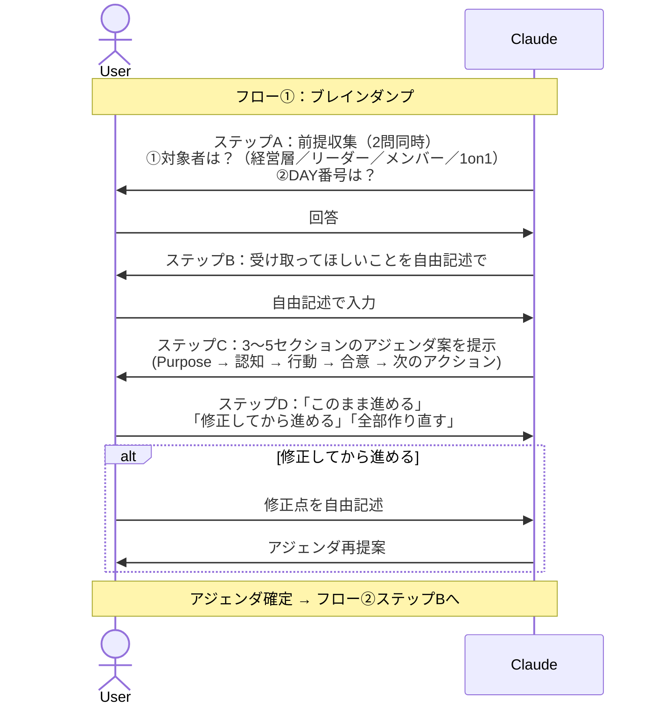
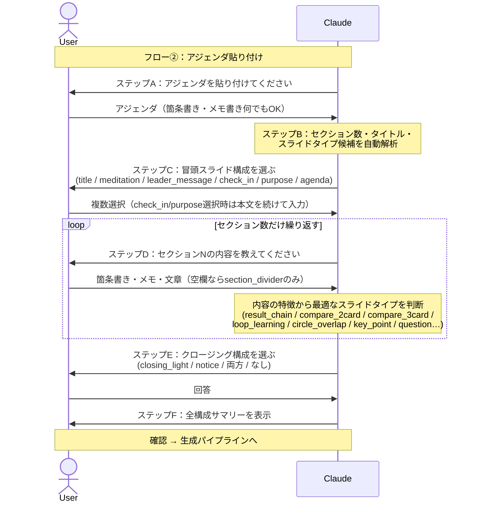
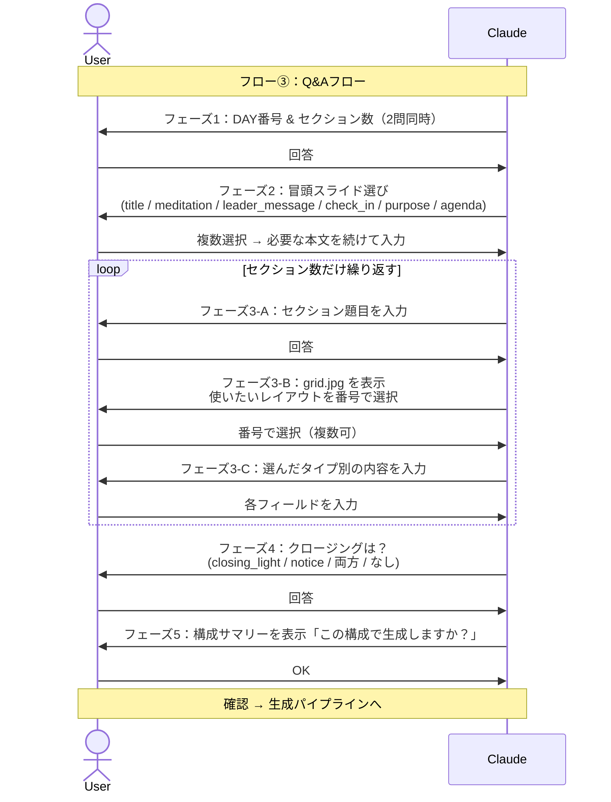
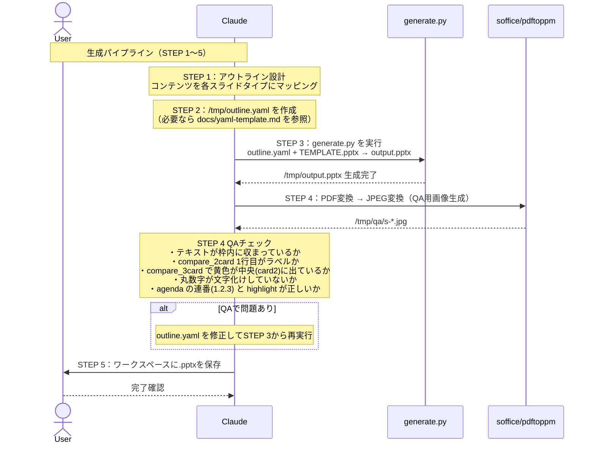
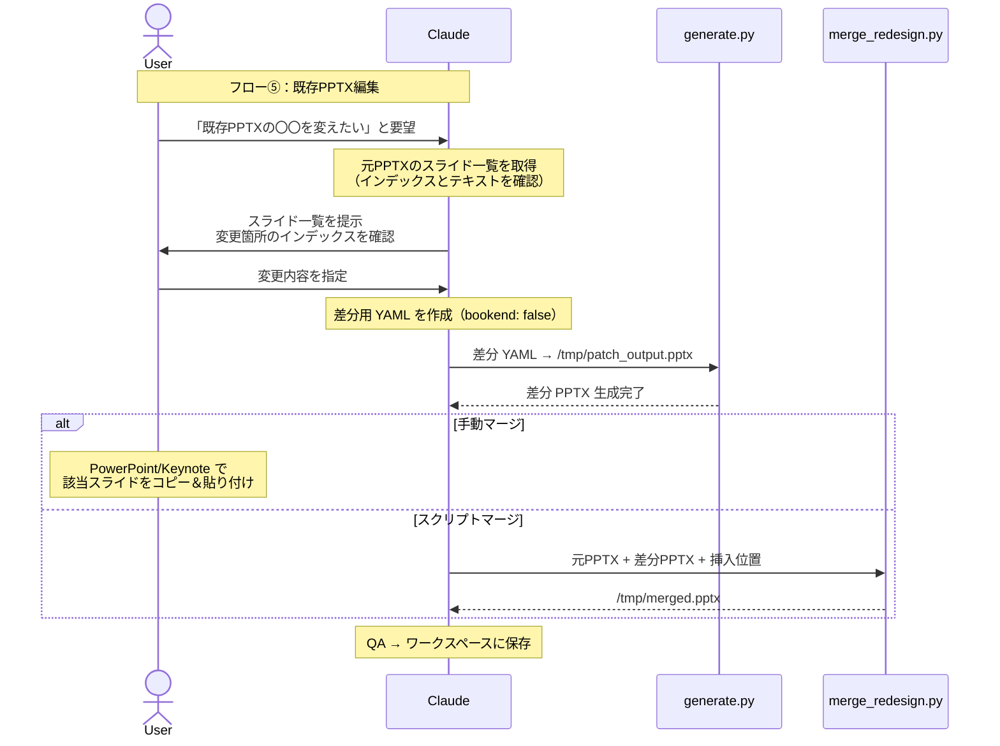
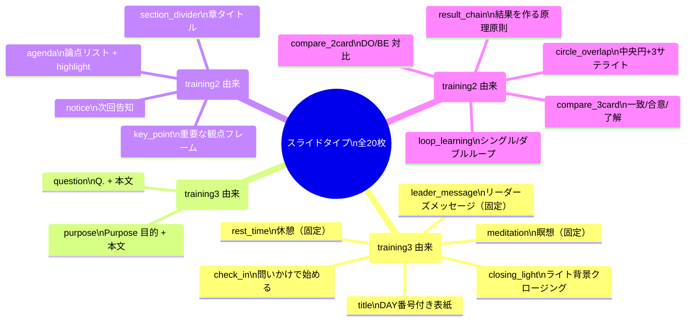
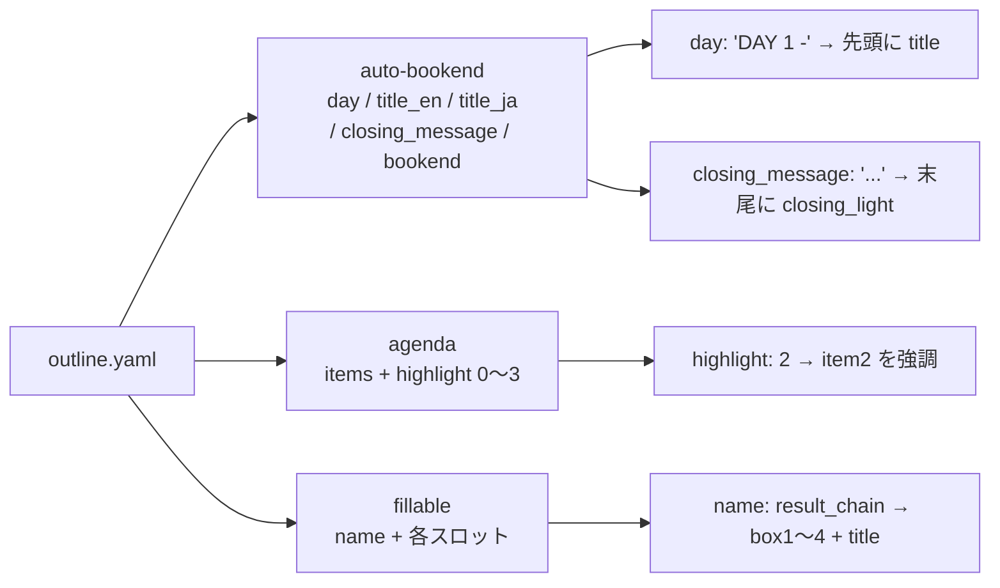

# org-coaching スキル フロー解説

組織コーチング（MIZUKARA ブランド）の PPTX スライドをテキスト入力から自動生成するスキルの処理フローを説明します。

---

## 全体フロー概要



---

## ユーザー状態の検出

スキル起動直後に 1 問の Ask（4 択）でユーザーの準備状況を判定します。
会話の文脈からすでに状態が明らかな場合（テキストが貼られている等）は質問をスキップします。

| 選択肢 | 状態名 | 進むフロー |
|--------|--------|-----------|
| 1. まだ何も決まっていない | braindump | フロー① |
| 2. テーマは決まっているが内容はこれから | theme-only | フロー③ |
| 3. アジェンダはあるが各スライドの内容がまだ | theme+agenda | フロー② |
| 4. 内容（テキスト・箇条書き）がほぼ揃っている | all-ready | フロー④ |

---

## フロー① ブレインダンプ（状態 1：何も決まっていない）

コンテンツがゼロの状態から Claude が一緒にアジェンダを設計します。
完了後はフロー②（アジェンダ貼り付け）へ引き継ぎます。



---

## フロー② アジェンダ貼り付け（状態 3：アジェンダがある）

章立てはあるがスライド内容がまだの状態。アジェンダを受け取り、
オープニング（title / meditation / leader_message / check_in / purpose）の構成と
各セクションの内容を収集します。



---

## フロー③ Q&Aフロー（状態 2：テーマのみある）

テーマはあるが内容がゼロの状態。セクションごとに 1 つずつ質問して内容を収集します。



---

## フロー④ 直接生成モード（状態 4：内容が揃っている）＆ 生成パイプライン

すべてのフローの最終段階。YAML を作成してスクリプトを実行し、QA を行って保存します。



---

## フロー⑤ 既存 PPTX の編集

生成済みの PPTX へのスライド追加・置換・削除。
（現状の `generate.py` は edit/patch モード未対応のため、差分 PPTX を作って手動マージする運用）



---

## スライドタイプ一覧

スキルが扱えるスライドの種類は大きく 3 カテゴリに分かれます。



---

## YAML オプション早見表



---

## ファイル構成

```
.claude/skills/org-coaching/
├── SKILL.md                  # スキル本体（フロー分岐・STEP定義）
├── assets/
│   ├── TEMPLATE.pptx         # デザインテンプレート（20枚）
│   └── thumbnails/
│       ├── grid.jpg          # 全20タイプのグリッド画像
│       └── {type}.jpg        # 個別サムネ
├── scripts/
│   ├── generate.py           # PPTX生成スクリプト
│   ├── make_template.py      # training3 + training2 → TEMPLATE.pptx
│   ├── make_grid.py          # サムネ生成
│   └── merge_redesign.py     # 既存PPTXへのマージ補助
├── flows/
│   ├── flow1_braindump.md    # フロー①の詳細手順
│   ├── flow2_agenda.md       # フロー②の詳細手順
│   ├── flow3_qa.md           # フロー③の詳細手順
│   └── flow5_edit.md         # フロー⑤の詳細手順
└── docs/
    ├── FLOW.md               # 本ドキュメント（フロー全体図）
    ├── manual.md             # エンドユーザー向け使い方マニュアル
    ├── yaml-template.md      # 全タイプのYAMLフィールド一覧・サンプル
    ├── sample_outline.yaml   # 動作確認用デッキ
    └── setup.md              # セットアップ手順
```
